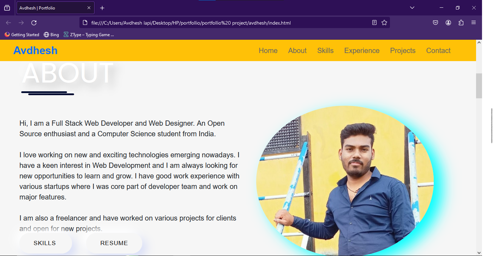

# PortFollio Website

# Project Description

This project is a personal portfolio website created using HTML, CSS, and JavaScript. It showcases your skills, projects, experiences, and contact information. The portfolio website serves as a digital resume and a platform to display your work to potential employers, clients, or collaborators.

## Demo

[Website : Avdhesh kushvaha](https://poetic-tartufo-e1fd6d.netlify.app/)

# How to Use:

Clone the Repository
Open the Project
Navigate to the project directory and open the index.html file in a web browser.

Explore the Portfolio:
Once the index.html file is opened in the web browser, you'll see the homepage of the portfolio website. Navigate through different sections such as About Me, Projects, Skills, and Contact to explore your portfolio content.

# Project Structure

index.html: This file contains the structure of the portfolio website.

styles.css: This file contains the CSS styles for styling the portfolio website.

app.js: This file contains the JavaScript code for any interactive elements or dynamic content on the portfolio website.

Technologies Used

HTML: Used for creating the structure and content of the portfolio website.

CSS: Used for styling the visual presentation of the portfolio website.

JavaScript: Used for adding interactivity and dynamic behavior to the portfolio website.

